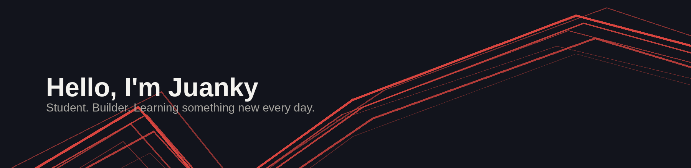

Growing my skills in full-stack development and data-driven systems. Second-year CS student at Tec de Monterrey, competing in ICPC since 2025, with hands-on SAP consulting experience.

`Python` `C++` `Flask` `React` `SQL`

**Featured projects**

**F1 Dashboard** 
Live Formula 1 race results and data analytics, built with Flask and React. <a href="https://f1-dashboard-7fuf.vercel.app" target="_blank" rel="noopener noreferrer">live demo</a>

**Altur voice deepfake detector** 
Built for HackMTY26, reaching 92.9% accuracy and 0.987 AUC, verified by organizers. <a href="https://github.com/jkyplayz-rb/hackmty26-altur-voicechallenge" target="_blank" rel="noopener noreferrer">repo</a>

**SAP threat detector** 
Real-time anomaly detection on SAP logs, finished top 8 of 21 teams. <a href="https://github.com/danieldiazde/sap-threat-detector" target="_blank" rel="noopener noreferrer">repo</a>

**World Cup predictor** 
Real users made predictions during the FIFA World Cup 2026. <a href="https://github.com/jkyplayz-rb/worldcup-predictor" target="_blank" rel="noopener noreferrer">repo</a>

Currently working on F1 Dashboard