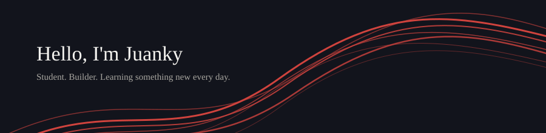

Growing my skills in full-stack development and data-driven systems. Second-year CS student at Tec de Monterrey, competing in ICPC since 2025, with hands-on SAP consulting experience.

`Python` `C++` `Flask` `React` `SQL`

**Featured projects**

**F1 Dashboard** — Live Formula 1 race results and data analytics, built with Flask and React
[live demo](https://f1-dashboard-7fuf.vercel.app)

**Altur voice deepfake detector** — Built for HackMTY26, reaching 92.9% accuracy and 0.987 AUC, verified by organizers
[repo](https://github.com/jkyplayz-rb/hackmty26-altur-voicechallenge)

**SAP threat detector** — Real-time anomaly detection on SAP logs, finished top 8 of 21 teams
[repo](https://github.com/danieldiazde/sap-threat-detector)

**World Cup predictor** — Real users made predictions during the FIFA World Cup 2026
[repo](https://github.com/jkyplayz-rb/worldcup-predictor)

Currently working on F1 Dashboard